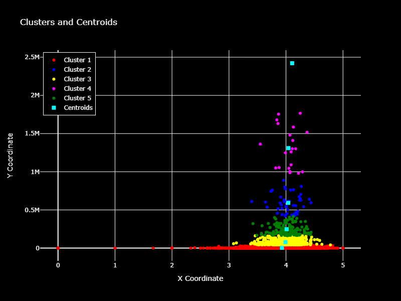
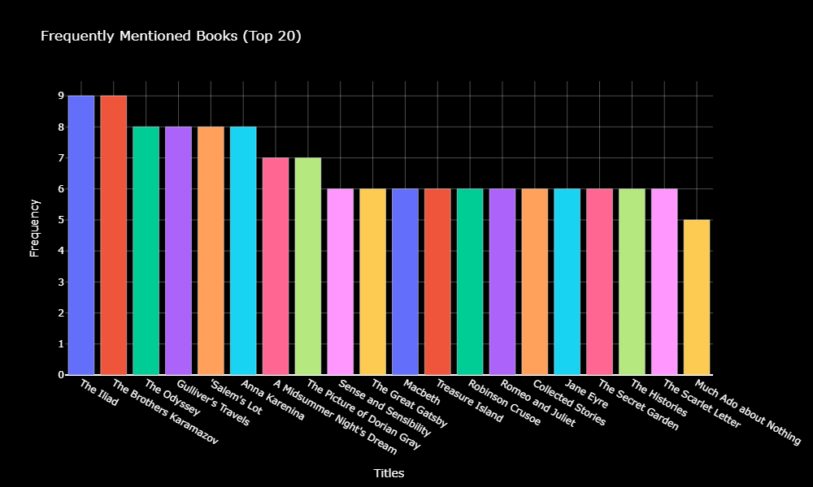
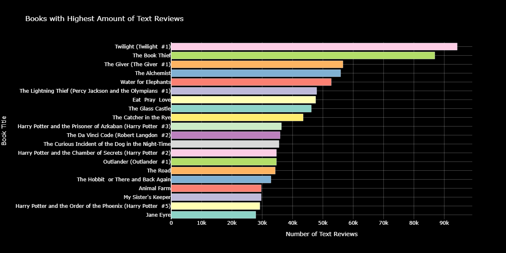
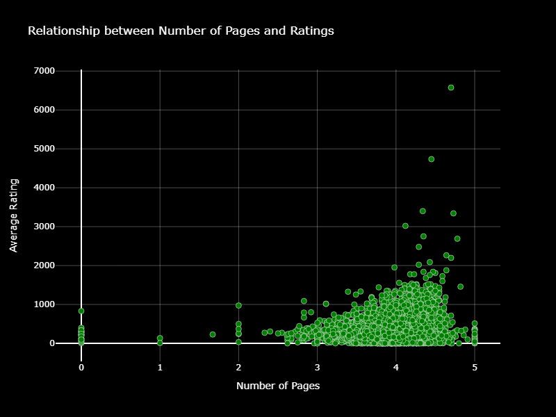

# Goodreads Data Analysis and Book Recommender System 
#### 

## Recommendation System Results using K Nearest Neighbors
***
### Book Recommendation System Results

***
### Elbow Curve to Determine Optimal K value

***
### Clusters and Centroids in Dataset

## Exploratory Data Analysis
***
### Top 20 Book Publishers

***
### Most Frequent Books in Dataset

***
### Top 20 Authors

***
### Books with Highest Written Reviews

***
### Distribution of Ratings 

***
### Book Ratings Pie Chart

***
### Relationship between Pages and Ratings
